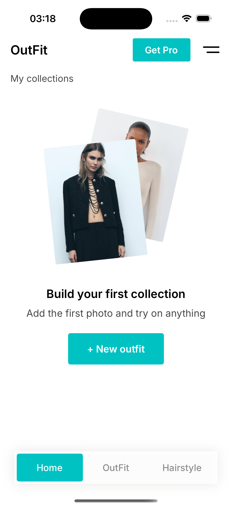
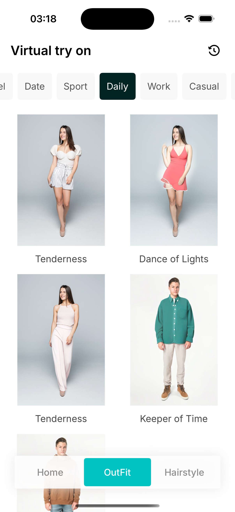
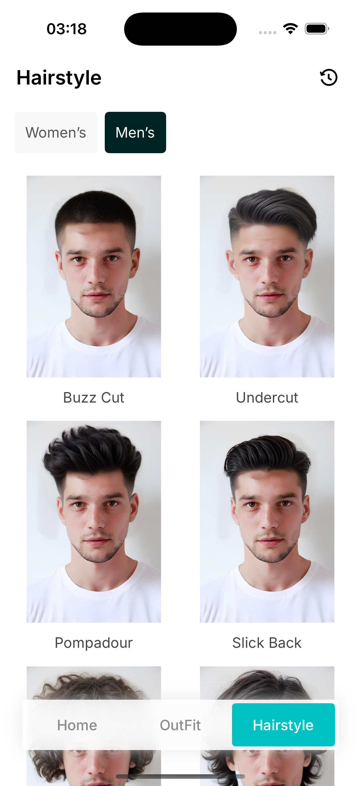

# Fashion AI 

**iOS приложение с ИИ для виртуальной примерки одежды и причесок**

---

## 🌟 Обзор

**Fashion AI — это iOS-приложение, которое позволяет пользователям виртуально примерять одежду и прически, используя собственные фотографии. Приложение направлено на персонализацию стиля, создание коллекций и визуализацию образов с помощью AI.

### 🎯 Ключевые возможности

- **🤖 ИИ-виртуальная примерка**: Продвинутые алгоритмы ИИ для реалистичной визуализации одежды и причесок
- **👔 Категории моды**: 9 различных стилевых категорий (Вечеринка, Формальный, Путешествие, Особый, Повседневный, Работа, Ежедневный, Спорт, Свидание)
- **👥 Гендерные коллекции**: Отдельные коллекции для мужской и женской моды
- **💇‍♀️ Примерка причесок**: Виртуальное тестирование различных причесок
- **📱 Мультиязычность**: Поддержка 6 языков (Английский, Русский, Немецкий, Испанский, Французский, Арабский)
- **💾 Управление коллекциями**: Создание и организация любимых образов
- **📸 Управление фото**: Импорт из галереи или съемка напрямую
- **🎨 HD качество**: Высококачественная обработка изображений
- **⭐ Премиум функции**: Неограниченные генерации, HD качество, без водяных знаков

---

## 🚀 Функции

### Виртуальная примерка
- **Виртуализация нарядов**: Примерка различных стилей одежды
- **Тестирование причесок**: Эксперименты с различными прическами
- **Фильтрация по категориям**: Организация стилей по случаю и предпочтениям
- **Обработка в реальном времени**: Быстрая ИИ-генерация изображений

### Пользовательский опыт
- **Интуитивный интерфейс**: Чистый и современный дизайн
- **Онбординг**: Пошаговое знакомство с функциями приложения
- **Управление коллекциями**: Сохранение и организация любимых образов
- **История**: Просмотр предыдущих генераций
- **Настройки**: Персонализация языка и настроек приложения

### Технические возможности
- **Локальное хранение**: Локальное хранение и управление изображениями
- **Сжатие изображений**: Оптимизированная обработка изображений
- **API интеграция**: Бесшовная связь с бэкендом
- **Управление подписками**: Премиум функции с интеграцией Apphud

---

## 📱 Скриншоты

| Главный экран | Виртуальная примерка | Прически | Результаты |
|---------------|----------------------|-----------|------------|
|  |  |  |  |

---

## 🛠 Технический стек

### Основные технологии
- **Swift 5.0+**: Современная разработка для iOS
- **UIKit**: Нативная iOS UI-платформа
- **Storyboard**: Interface Builder для дизайна UI
- **UserDefaults**: Настройки и предпочтения

### ИИ и бэкенд
- **REST API**: Связь с бэкендом для ИИ-обработки
- **Обработка изображений**: Продвинутая манипуляция и сжатие изображений
- **Multipart Form Data**: Эффективная загрузка изображений

### Сторонние интеграции
- **ApphudSDK**: Управление подписками и платежами
- **StoreKit**: Интеграция покупок в приложении
- **Inter Font**: Кастомная типографика

### Архитектура
- **MVC паттерн**: Архитектура Model-View-Controller
- **Notification Center**: Межкомпонентная коммуникация
- **Extension System**: Модульная организация кода

---

## 🌍 Локализация

Приложение поддерживает 6 языков:
- 🇺🇸 Английский
- 🇷🇺 Русский  
- 🇩🇪 Немецкий
- 🇪🇸 Испанский
- 🇫🇷 Французский
- 🇸🇦 Арабский

---

## 💰 Монетизация

### Бесплатная версия
- Ограниченные генерации (2 бесплатных наряда, 2 бесплатные прически)
- Базовое качество изображений
- Результаты с водяными знаками

### Премиум подписка
- **Неограниченные генерации**: Без лимитов на ИИ-обработку
- **HD качество фото**: Высококачественный вывод изображений
- **Без водяных знаков**: Чистые, профессиональные результаты
- **3-дневный пробный период**: Безрисковый премиум опыт
- **Месячные/годовые планы**: Гибкие варианты подписки

### Интеграция платежей
- **ApphudSDK**: Управление подписками
- **StoreKit**: Система покупок в приложении Apple
- **Восстановление покупок**: Синхронизация подписок между устройствами

---

## 🔒 Приватность и безопасность

### Защита данных
- **Локальное хранение**: Изображения хранятся локально на устройстве
- **Безопасный API**: Зашифрованная связь с бэкендом
- **Минимум личных данных**: Минимальный сбор данных
- **Политика приватности**: Прозрачная обработка данных

### Разрешения
- **Доступ к камере**: Для съемки фотографий
- **Фото библиотека**: Для импорта изображений
- **Сетевой доступ**: Для ИИ-обработки

## 👨‍💻 Автор

**Никита Горьковой**
- **Email**: [HarkavyNikita@gmail.com]
- **GitHub**: [@NikitaHarkavy](https://github.com/NikitaHarkavy)
- **LinkedIn**: [LinkedIn](https://www.linkedin.com/in/nikita-harkavy-5b8040305?utm_source=share&utm_campaign=share_via&utm_content=profile&utm_medium=ios_app)

 
